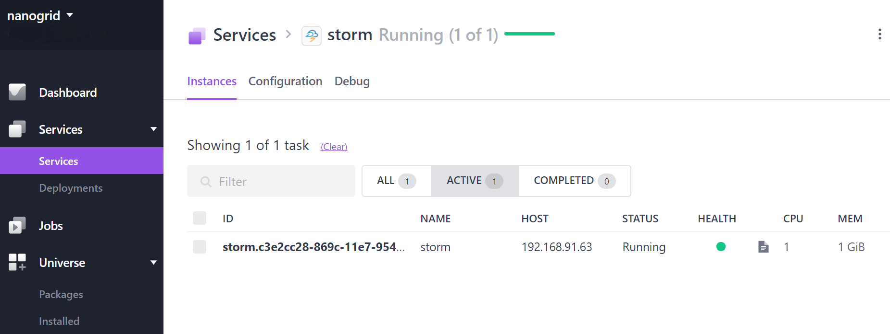

# How to use Apache Storm on DC/OS

[Apache Storm](http://storm.apache.org) is a distributed realtime computation system.
The [DC/OS Storm](https://github.com/mesos/storm) service is a Mesos framework that allows you to manage
and use Storm in a flexible and scalable way.

- Estimated time for completion: 5 minutes
- Target audience: Data engineers and data scientists a stream processing engine.
- Scope: Install and use Apache Storm.

**Table of Contents**:

- [Prerequisites](#prerequisites)
- [Install Storm](#install-storm)
- [Use Storm](#use-storm)
- [Uninstall Storm](#uninstall-storm)

## Prerequisites

- A running DC/OS 1.10 cluster with 2 agents with each 1 CPU and 1 GB of RAM available.
- [DC/OS CLI]((https://dcos.io/docs/1.10/cli/install/) installed.

## Install Storm

To install Storm, do:

```bash
$ dcos package install storm
By Deploying, you agree to the Terms and Conditions https://mesosphere.com/catalog-terms-conditions/#community-services
This DC/OS Service is currently in preview and there may be bugs, incomplete features, incorrect documentation or other discrepancies.
Continue installing? [yes/no] yes
Installing Marathon app for package [storm] version [0.1.0]
Storm is installed in your cluster.
```

After this, you should see the Storm service running via the `Services` tab of the DC/OS UI:



## Use Storm

SSH into your DC/OS cluster:

```
$ dcos node ssh --master-proxy --leader
core@ip-10-0-6-55 ~ $
```

Then you can access the Storm UI via the following URL: 

```
http://storm.mesos:$UI_PORT/index.html
```

With `$UI_PORT` being the first port assigned to the Storm service by the System Marathon. Note that you can either look up that port via the `Services` tab or directly using a DC/OS CLI command like the following:

```bash
$ dcos marathon app show /storm | grep -A 30 tasks | grep -A 2 ports
      "ports": [
        11585,
        11586
```

So in our example case the value for `$UI_PORT` (`ui.port` in the Storm config) would be `11585`. Note also that the second value you see here, `11586`, is `nimbus.thrift.port`.

## Uninstall Storm

To uninstall Storm:

```bash
$ dcos package uninstall storm
```

## Further resources

1. [DC/OS Storm Official Documentation](https://github.com/mesos/storm)
1. [Apache Storm 1.0.1 docs](http://storm.apache.org/releases/1.0.1/)


